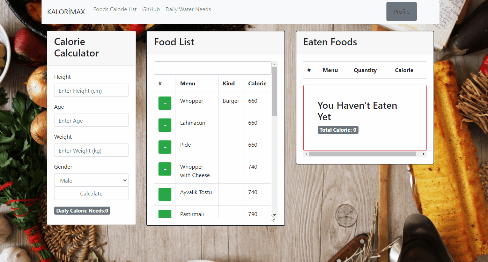

A fantastic calorie calculate app with daily water needs, foods calorie list and add to daily eats cart. Built with react,react-redux, redux, redux thunk, firebase, redux-saga, bootstrap. 

## Main Branch is dev

## Available Scripts

In the project directory, you can run:

### `npx json-server --watch db.json`

Download this db.json file in the THE-REK-JSON-data branch. 
Runs the data in the development mode 
Open [http://localhost:3000/foods](http://localhost:3000/foods) to view it in the browser.

### `npm start`

Runs the app in the development mode. 
Open [http://localhost:3001](http://localhost:3001) to view it in the browser.

The page will reload if you make edits. 
You will also see any lint errors in the console.

### `npm test`

Launches the test runner in the interactive watch mode. 
See the section about [running tests](https://facebook.github.io/create-react-app/docs/running-tests) for more information.

### `npm run build`

Builds the app for production to the `build` folder. 
It correctly bundles React in production mode and optimizes the build for the best performance.

The build is minified and the filenames include the hashes. 
Your app is ready to be deployed!

See the section about [deployment](https://facebook.github.io/create-react-app/docs/deployment) for more information.

### Nasıl Çalıştırılacağına Dair Türkçe Açıklama
THE-REK-foods-JSON-data branch'ındaki db.json dosyasını bilgisayarımızda klasör oluşturup içine atıyoruz. 
Visual Studio Code terminalinde db.json'ın klasörüne cd kodu ile gidiyoruz. Sonra "npx json-server --watch db.json" komutunu yazıp enter'a basıyoruz. 
Localhost:3000de olması için React projesini başlatmadan önce db.json'ın yayına sokulması gerekiyor. 
Pull ettiğimiz kodların klasörünü bulup visual studio code'dun terminalinde npm start diyerek başlatıyoruz.

